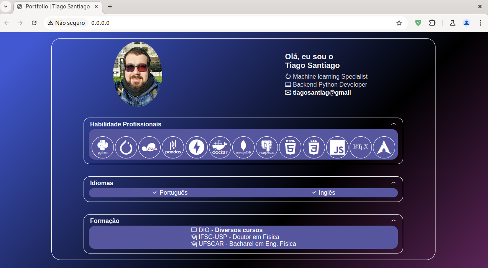
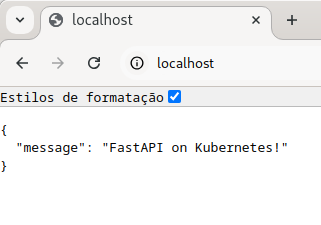

<h1>
<a href="https://www.dio.me/">
     </a>
    <span>Microsoft Azure Advanced</span>
</h1>

# :computer: Docker: Criando um Pipeline de Deploy de uma Aplicação Utilizando Gitlab, Docker e Kubernetes

Nesse desavio vamos fazer um deploy de uma aplicação usando docker e kubernetes.

[Gitlab do instrutor](https://gitlab.com/denilsonbonatti/gitlab-cicd-app-base/-/tree/main)

# :bulb: Solução do desafio

## Docker deploy

Utilizarei o fastapi com o uvicorn para rodar meu app com frontend um template de [portfólio](https://github.com/tsdes-santiago/DIO_JS_Portfolio) que coloquei na pasta pages:

```console
pages
├── assets
│   ├── images
│   │   └── tiago.png
│   ├── scripts
│   │   └── main.js
│   └── styles
│       ├── global.css
│       ├── main.css
│       └── reset.css
└── index.html
```

Referentes ao diretório `deploy_docker`.

Nosso app está definido em `deploy_docker/main.py`

```python
from fastapi import FastAPI
from fastapi.staticfiles import StaticFiles
import nest_asyncio

app = FastAPI()

#mount static files
app.mount("/", StaticFiles(directory="/pages", html=True), name="pages")

nest_asyncio.apply()

```

Em que montamos os arquivos estáticos no diretório `/pages` do container que será adicionado como volume no arquivo de configuração `yml`.

Para gerar a imagem com python e instalar as dependências definimos o Dockerfile:

```dockerfile
# Instala o python 3.12
FROM python:3.12

# Cria o diretório de trabalho
WORKDIR /code

# Instala as dependências do projeto
COPY requirements.txt ./

RUN pip install --no-cache-dir -r requirements.txt

# Expõe a porta 80
EXPOSE 80

# Copia o projeto para o diretório
COPY . .

# Inicia o servidor web uvicorn
CMD ["uvicorn", "main:app", "--host", "0.0.0.0", "--port", "80"]
```

A imagem é gerada e o volume montado com o arquivo `docker-compose.yml`:

```yml
services:
  webapp:
    build: .
    ports:
      - "80:80"
    volumes:
      - ../pages:/pages
```

Executo no terminal para gerar a imagem e rodar o container

```console
$ docker compose up -d
```

Conferindo o container

```console
$ docker ps
CONTAINER ID   IMAGE                  COMMAND                  CREATED              STATUS              PORTS                               NAMES
f0642a7c1119   deploy_docker-webapp   "uvicorn main:app --…"   About a minute ago   Up About a minute   0.0.0.0:80->80/tcp, :::80->80/tcp   deploy_docker-webapp-1
```

O app está rodando

```console
$ docker logs deploy_docker-webapp-1
INFO:     Started server process [1]
INFO:     Waiting for application startup.
INFO:     Application startup complete.
INFO:     Uvicorn running on http://0.0.0.0:80 (Press CTRL+C to quit)
```

Podemos acessar o IP e ver o portfólio.

<p align=center>

</p>

Parando a execução 

```console
$ docker compose down
[+] Running 2/2
 ✔ Container deploy_docker-webapp-1  Removed                                                       0.5s 
 ✔ Network deploy_docker_default     Removed     
 ```

 Removendo as imagens
 ```console
 $ docker rmi -f $(docker images -aq)
Untagged: deploy_docker-webapp:latest
Deleted: sha256:e8b8260f5df3795dd2563ba133a46883a96d34d8397672e01f8e40793b59e26b
```

## Kubernetes deploy

Usaremos o pacote [kind](https://kind.sigs.k8s.io/docs/user/quick-start) para criar cluster k8s locais. Quando executado em nuvem, o LoadBalancer usa o serviço do provedor na nuvem, no caso de cluster local teríamos que configurar um load balancer externo, como um proxy reverso [ingress nginx](https://kind.sigs.k8s.io/docs/user/ingress/), o que não está o escopo desse projeto.

Os comandos são executados na pasta `deploy_k8s`.

Utilizo um simples app definido em `main.py`:

```python
from fastapi import FastAPI


app = FastAPI()


@app.get("/")
async def root():
    return {"message": "FastAPI on Kubernetes!"}
```

Que simplesmente retorna a mensagem "FastAPI on Kubernetes!"

No `Dockerfile` expus a porta 8000 para ficar melhor para diferenciar as portas nas configurações.

Gerando a imagem docker:

```console
$ docker build -t fastapi-img .
```

Configuração do cluster com kind (`cluster_config.yml`):

```yml
kind: Cluster
apiVersion: kind.x-k8s.io/v1alpha4
name: fastapi-cluster
nodes:
- role: control-plane
  extraPortMappings:
  - containerPort: 30005
    hostPort: 80
```

A `containerPort` tem que ser a mesma da `nodePort` em serviços para podermos expor a porta do container. 

Criando o cluster:

```console
$ kind create cluster --config cluster_config.yml 
```

Carregando a imagem docker para o cluster:

```console
$ kind load docker-image fastapi-img --name fastapi-cluster
```

Configurando o deployment:

```yml
apiVersion: apps/v1
kind: Deployment
metadata:
  name: fastapi-deployment
spec:
  replicas: 2
  selector:
    matchLabels:
      app: fastapi
  template:
    metadata:
      labels:
        app: fastapi
    spec:
      containers:
      - name: fastapi
        image: fastapi-img
        imagePullPolicy: Never
        ports:
        - containerPort: 8000
---

apiVersion: v1
kind: Service
metadata:
  name: fastapi-service
spec:
  selector:
    app: fastapi
  type: NodePort
  ports:
  - name: http
    nodePort: 30005
    port: 8000
```

Como carreguei a imagem docker, adicionei `imagePullPolicy: Never` no deployment. A `containerPort: 8000` é a mesma que expus na imagem docker.

Em Service, a `nodePort` é a mesma que a `containerPort` definida na configuração do cluster e a `port` é a mesma `containerPort` do deployment.

Executando o deployment:

```console
$ kubectl apply -f deployment.yml 
```

Podemos observar as duas réplicas rodando:

```console
$ kubectl get pods
NAME                                  READY   STATUS    RESTARTS   AGE
fastapi-deployment-7b8b849dc7-f5jxr   1/1     Running   0          20s
fastapi-deployment-7b8b849dc7-skngm   1/1     Running   0          20s
```

Como definimos a porta 80 em `hostPort` no arquivo de configuração do cluster, acessamos o app em `localhost`:

<p align=center>

</p>


Deletando o cluster:

```console
$ kind delete cluster --name fastapi-cluster
Deleting cluster "fastapi-cluster" ...
Deleted nodes: ["fastapi-cluster-control-plane"]
```

Deletando a imagem docker:

```console
$ docker image rm fastapi-img
Untagged: fastapi-img:latest
Deleted: sha256:e800c50ea2c8d754a09608fc8a45d580eedad8325097d29bdca655d7b8591769
Deleted: sha256:32ab87c869dbe52c3f4a57c51aa698345de5ec46077f90a56b5cbc9d43f3fb9a
Deleted: sha256:07e02675e2915b6829166cf8375cb037ef76ff6eeae2ca90ccd6f82f9ae4d71c
Deleted: sha256:1aa3fb7c62600fd40e4c3b0874be97d7297798fd6a19db081ff78afacc871972
Deleted: sha256:29d4446fb9d6223fffa0507363c0b4325c2685576747916a2171b35c8e9f489a
Deleted: sha256:62cf5290a6e85f39731a117d20d158f6ac6d6cdd7b09d02c189e8f95f5aa864d
Deleted: sha256:09b30bde511f65b773ec2f5a9227172583fc219bb4a1323df0a852c195a36542
Deleted: sha256:2a904045af54571c761b0d33d1317b95da4195729b1d03c814585420949a2727
Deleted: sha256:f8482aa582020f61bab717a70e5f0f340da57ef496d0b38a76f914e4e28c2b45
Deleted: sha256:c017e3f494342bb8922b0ae74ac4b17c50b5d367c1cffd55ce51e5ffb38113c0
```


