<h1>
<a href="https://www.dio.me/">
     </a>
    <span>Microsoft Azure Advanced</span>
</h1>

# :computer: Docker: Utilização Prática no Cenário de Microsserviços

A tecnologia de Containers promete mudar a maneira como as operações de TI são realizadas, abstraindo ambientes de desenvolvimento e otimizando o consumo de recursos. Nesse contexto, conheça o Docker, implemente uma estrutura de Microsserviços com as melhores práticas do mercado internacional e ganhe independência entre aplicações e infraestrutura em mais um conteúdo exclusivo por aqui.


# :bulb: Solução do desafio

Nesse projeto, crio os nós na AWS, executo microsserviços. O passo a passo está descrito abaixo. Por fim, utilizo o NGINX proxy para fazer o load balance no Cluster Swarm, em que uma aplicação PHP insere dados em um banco de dados MySQL.

Após a execução deletei os todos os nós para não gerar cobrança adicional da AWS.

## Criando os nós na AWS

### Configurar rede e faixas de IP para máquinas virtuais conversarem entre si

1. Acesse o serviço VPC (nuvem privada virtual) e crie uma nova VPC

<p align=center>
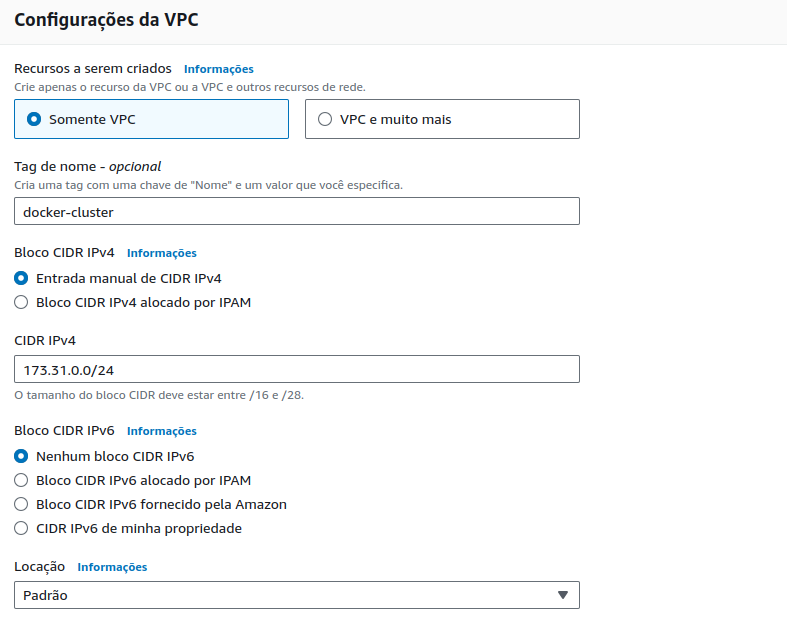
</p>

2. Configurando a sub-rede

- Crie uma sub-rede com ID da VPC docker-cluster (criada no passo 1)

<p align=center>
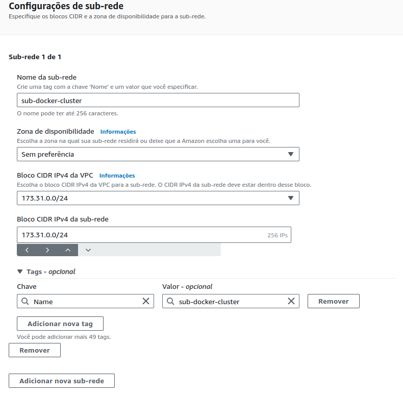
</p>

3. Gateway de internet

- Criar um gateway de internet

<p align=center>
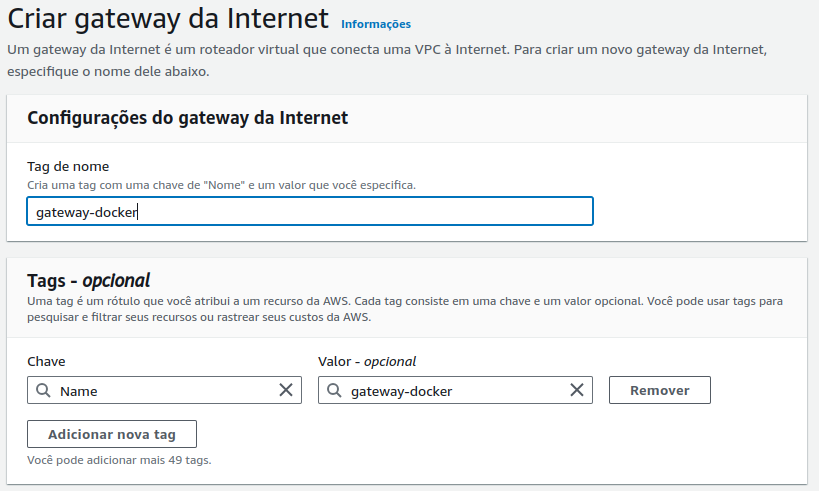
</p>

- Associar a uma vpc - escolher docker-cluster

<p align=center>
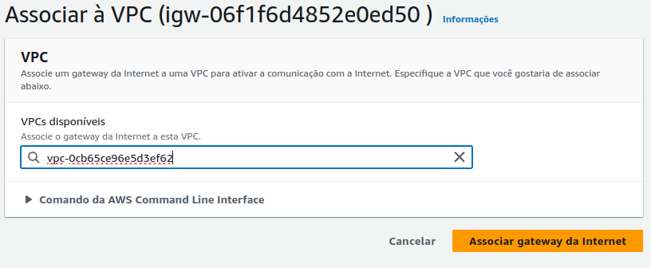
</p>


4. Tabela de rotas

- Clicar no id da tabela de rotas da VPC docker-cluster 

- Editar rotas, adicionar rota de todos para gateway

<p align=center>
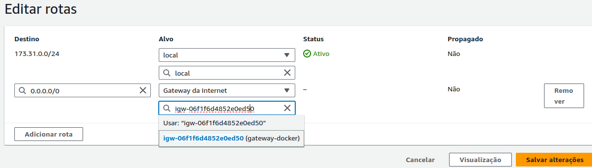
</p>


### Criar nós EC2

- Acessar o serviço EC2 e clicar em executar instância

- Nome: Docker Swarm

- Imagens de aplicação e de sistema operacional (imagem de máquina da Amazon): Ubuntu

- Tipo de instância t2.micro

- Par de chaves: 
  - Criar novo par de chaves
      - nome: docker-swarm
      - tipo: RSA
      - formato: .pem (acessar opor OpenSSH)

  - Salve o arquivo .pem

- Número de instâncias: 4

- Editar configurações de rede
  - VPC: docker-cluster 
  - Sub-rede: sub-docker-cluster
  - Atribuir IP público automaticamente: Habilitar
  - Criar grupo de segurança
    - Nome do grupo de segurança: Docker-Swarm
    - Descrição: Docker-Swarm security group

- Detalhes avançados
  - Dados do usuário

  ```bash
  #!/bin/bash

  echo "Instalando o Docker......."

  apt-get update -y
  apt-get install ca-certificates curl gnupg lsb-release -y
  mkdir -p /etc/apt/keyrings
  curl -fsSL https://download.docker.com/linux/ubuntu/gpg | gpg --dearmor -o /etc/apt/keyrings/docker.gpg

  echo \
    "deb [arch=$(dpkg --print-architecture) signed-by=/etc/apt/keyrings/docker.gpg] https://download.docker.com/linux/ubuntu \
    $(lsb_release -cs) stable" | tee /etc/apt/sources.list.d/docker.list > /dev/null

  apt-get update -y
  apt-get install docker-ce docker-ce-cli containerd.io docker-compose-plugin -y


  echo "Criando o container......."

  docker run  --name apache-A -d -p 80:80 --volume=/site:/usr/local/apache2/htdocs/ httpd
  ```
Assim subimos a máquina virtual com o docker já instalado. O script está disponível no [github do instrutor](https://github.com/denilsonbonatti/docker-ubuntu-install-dio/blob/main/install-docker-ubuntu.sh)

Após essas configurações, executar instância

<p align=center>

</p>

Podemos ver as instâncias (nós) e seus IPs públicos para acessar com SSH

<p align=center>
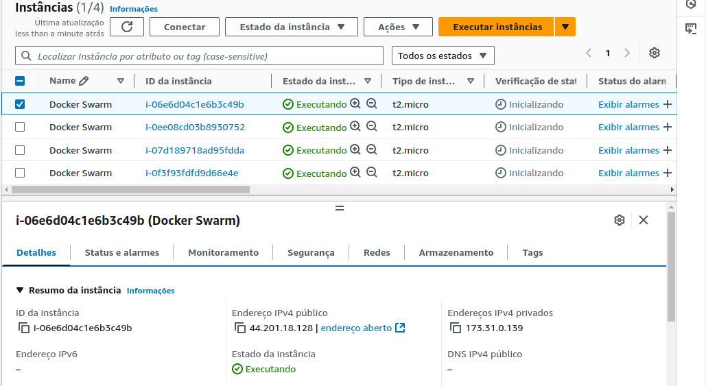
</p>

## Iniciando um Cluster Swarm 

## Conectando com o primeiro nó por SSH

- Mudando permissões do arquivo pem
```console
$ chmod 400 docker-swarm.pem
```
- Conectando ao nó usando o IP público
```console
$ ssh -i docker-swarm.pem ubuntu@44.201.18.128
```
ubuntu é o usuário padrão.

- Mudando o hostname para aws1

```console
ubuntu@ip-173-31-0-139:~$ sudo su
root@ip-173-31-0-139:/home/ubuntu# hostnamectl hostname aws1
root@ip-173-31-0-139:/home/ubuntu# su
root@aws1:/home/ubuntu# 
```

- Iniciando o docker swarm

```console
root@aws1:/home/ubuntu# docker swarm init
Swarm initialized: current node (ws2mbmf8nboyxp42504iew9ji) is now a manager.

To add a worker to this swarm, run the following command:

    docker swarm join --token SWMTKN-1-5bj93dd8290wanbdkss30ffxn37bg7s2gcmkw36jm5szsnzb6d-aauz3lfnf1pro69s2v60dbiou 173.31.0.139:2377

To add a manager to this swarm, run 'docker swarm join-token manager' and follow the instructions.

root@aws1:/home/ubuntu# 
```

Note que foi solicitada a porta 2377, devemos editar as regras de entrada na aws para liberar essa porta e conectar os demais clusters.

<p align=center>
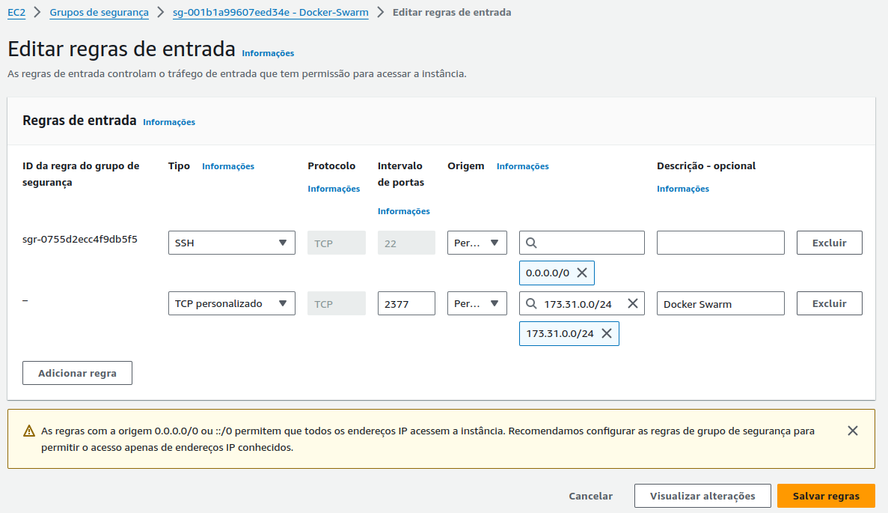
</p>

## Adicionando demais nós ao cluster swarm 

- Analogamente conectamos aos demais nós e renomeamos o hostname

- Adicionamos como worker no docker swarm com o comando gerado anteriormente

```console
root@aws2:/home/ubuntu# docker swarm join --token SWMTKN-1-5bj93dd8290wanbdkss30ffxn37bg7s2gcmkw36jm5szsnzb6d-aauz3lfnf1pro69s2v60dbiou 173.31.0.139:2377
This node joined a swarm as a worker.
```
- Checando o cluster no primeiro nó (leader)

```console
root@aws1:/home/ubuntu# docker node ls
ID                            HOSTNAME   STATUS    AVAILABILITY   MANAGER STATUS   ENGINE VERSION
ws2mbmf8nboyxp42504iew9ji *   aws1       Ready     Active         Leader           27.3.1
97adadz3zfttpyiuu0bibxb9u     aws2       Ready     Active                          27.3.1
7tz5i4vmqusmw8o00estt6xxi     aws3       Ready     Active                          27.3.1
w7ce71e9vmelyh9jmpxyimk90     aws4       Ready     Active                          27.3.1
root@aws1:/home/ubuntu# 
```

## Criando um serviço no cluster

- Acessar o nó leader do cluster

- Listando serviços
```console
ubuntu@aws1:~$ sudo su
root@aws1:/home/ubuntu# docker service ls
ID        NAME      MODE      REPLICAS   IMAGE     PORTS
```

- Criando um serviço de webserver apache com 15 réplicas

```console
root@aws1:/home/ubuntu# docker service create --name web-server --replicas 15 -p 80:80 httpd
```
- Checando o serviço ativo

```console
root@aws1:/home/ubuntu# docker service ls
ID             NAME         MODE         REPLICAS   IMAGE          PORTS
q21vhmfo83zz   web-server   replicated   15/15      httpd:latest   *:80->80/tcp
```

Note que está usando a porta 80, devemos liberar essa porta no grupo de segurança na AWS.

<p align=center>
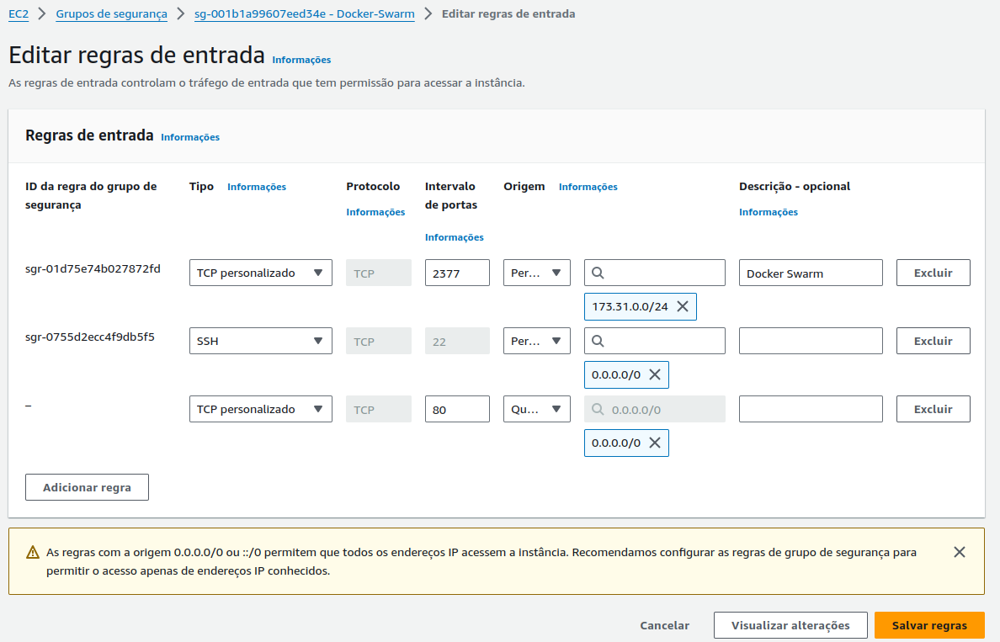
</p>

- Podemos ver o servidor ativo após liberar a porta

<p align=center>

</p>

- Checando a distribuição das réplicas nos nós

```console
root@aws1:/home/ubuntu# docker service ps web-server
ID             NAME            IMAGE          NODE      DESIRED STATE   CURRENT STATE                ERROR     PORTS
ndx5lyv83q54   web-server.1    httpd:latest   aws2      Running         Running about a minute ago             
m9ee0m0n8zwd   web-server.2    httpd:latest   aws1      Running         Running about a minute ago             
sj4i50wmr6ws   web-server.3    httpd:latest   aws2      Running         Running about a minute ago             
5cyrjbo1xkum   web-server.4    httpd:latest   aws4      Running         Running about a minute ago             
h35gsh52npxy   web-server.5    httpd:latest   aws4      Running         Running about a minute ago             
fobfjapo0ses   web-server.6    httpd:latest   aws2      Running         Running about a minute ago             
qj5f5ym4uxla   web-server.7    httpd:latest   aws3      Running         Running about a minute ago             
v9x4sn449i1m   web-server.8    httpd:latest   aws1      Running         Running about a minute ago             
mcb1xyw5b7p1   web-server.9    httpd:latest   aws3      Running         Running about a minute ago             
sdljdkculp85   web-server.10   httpd:latest   aws4      Running         Running about a minute ago             
uz94u802xl1d   web-server.11   httpd:latest   aws2      Running         Running about a minute ago             
x44uub8uj53m   web-server.12   httpd:latest   aws3      Running         Running about a minute ago             
ou3mrkicby3f   web-server.13   httpd:latest   aws1      Running         Running about a minute ago             
dauvqj7jlrd7   web-server.14   httpd:latest   aws3      Running         Running about a minute ago             
msucqgno3p80   web-server.15   httpd:latest   aws4      Running         Running about a minute ago  
```

## Eliminando os containers no nó 1

Vamos criar um banco de dados no nó 1 e, para que não seja sobrecarregado, eliminamos os containers do web-server desse nó e partir disso esse nó não recebe mais réplicas de containers.

```console
root@aws1:/home/ubuntu# docker node update --availability drain aws1
aws1
root@aws1:/home/ubuntu# docker service ps web-server
ID             NAME                IMAGE          NODE      DESIRED STATE   CURRENT STATE             ERROR     PORTS
ndx5lyv83q54   web-server.1        httpd:latest   aws2      Running         Running 10 minutes ago              
phujt8ozbvkw   web-server.2        httpd:latest   aws3      Running         Running 9 seconds ago               
m9ee0m0n8zwd    \_ web-server.2    httpd:latest   aws1      Shutdown        Shutdown 10 seconds ago             
sj4i50wmr6ws   web-server.3        httpd:latest   aws2      Running         Running 10 minutes ago              
5cyrjbo1xkum   web-server.4        httpd:latest   aws4      Running         Running 10 minutes ago              
h35gsh52npxy   web-server.5        httpd:latest   aws4      Running         Running 10 minutes ago              
fobfjapo0ses   web-server.6        httpd:latest   aws2      Running         Running 10 minutes ago              
qj5f5ym4uxla   web-server.7        httpd:latest   aws3      Running         Running 10 minutes ago              
exuj9oe19855   web-server.8        httpd:latest   aws2      Running         Running 9 seconds ago               
v9x4sn449i1m    \_ web-server.8    httpd:latest   aws1      Shutdown        Shutdown 9 seconds ago              
mcb1xyw5b7p1   web-server.9        httpd:latest   aws3      Running         Running 10 minutes ago              
sdljdkculp85   web-server.10       httpd:latest   aws4      Running         Running 10 minutes ago              
uz94u802xl1d   web-server.11       httpd:latest   aws2      Running         Running 10 minutes ago              
x44uub8uj53m   web-server.12       httpd:latest   aws3      Running         Running 10 minutes ago              
dmu0up01ac3q   web-server.13       httpd:latest   aws4      Running         Running 9 seconds ago               
ou3mrkicby3f    \_ web-server.13   httpd:latest   aws1      Shutdown        Shutdown 10 seconds ago             
dauvqj7jlrd7   web-server.14       httpd:latest   aws3      Running         Running 10 minutes ago              
msucqgno3p80   web-server.15       httpd:latest   aws4      Running         Running 10 minutes ago              
```

Para voltar a receber container pode-se utilizar o comando

```console
root@aws1:/home/ubuntu# docker node update --availability active aws1
```

## Consistência de dados no cluster

- Removendo o web-service
```
root@aws1:/home/ubuntu# docker service rm web-server
web-server
root@aws1:/home/ubuntu# docker service ls
ID        NAME      MODE      REPLICAS   IMAGE     PORTS
```

- Criando um volume de dados

```console
root@aws1:/home/ubuntu# docker volume create app
app
root@aws1:/home/ubuntu# cd /var/lib/docker/volumes/app/_data/
root@aws1:/var/lib/docker/volumes/app/_data# ls
```

O volume está inicialmente vazio. 

- Criando um arquivo html simples

```console
root@aws1:/var/lib/docker/volumes/app/_data# nano index.html
```
```html
<html>

<h1> Teste docker Swarm ! </h1>

</html>
```

- Criando serviço para executar nosso index.html
```console
root@aws1:/var/lib/docker/volumes/app/_data# docker node update --availability active aws1
aws1
root@aws1:/var/lib/docker/volumes/app/_data# docker service create --name meu-app --replicas 15 -dt -p 80:80 --mount type=volume,src=app,dst=/usr/local/apache2/htdocs/ httpd
muktk5hsrf5xg54rz94udkvc1
root@aws1:/var/lib/docker/volumes/app/_data# docker service ps meu-app
ID             NAME         IMAGE          NODE      DESIRED STATE   CURRENT STATE           ERROR     PORTS
rixn3a9dchbd   meu-app.1    httpd:latest   aws4      Running         Running 8 seconds ago             
vxdzds23rac3   meu-app.2    httpd:latest   aws2      Running         Running 7 seconds ago             
fp9uovruo0c2   meu-app.3    httpd:latest   aws2      Running         Running 7 seconds ago             
zu1u2wruq3ay   meu-app.4    httpd:latest   aws4      Running         Running 8 seconds ago             
x1uv7ns7vfif   meu-app.5    httpd:latest   aws4      Running         Running 8 seconds ago             
b6xgolw89q2v   meu-app.6    httpd:latest   aws3      Running         Running 8 seconds ago             
lat54sur6gxr   meu-app.7    httpd:latest   aws3      Running         Running 8 seconds ago             
hpth0u7555t4   meu-app.8    httpd:latest   aws3      Running         Running 8 seconds ago             
xnm2vjop97l6   meu-app.9    httpd:latest   aws4      Running         Running 8 seconds ago             
lmrbbq94hi9k   meu-app.10   httpd:latest   aws1      Running         Running 8 seconds ago             
aqlrn3s8sqsl   meu-app.11   httpd:latest   aws1      Running         Running 8 seconds ago             
5hhwwvl54t8n   meu-app.12   httpd:latest   aws1      Running         Running 8 seconds ago             
jsnn1nwxs9bm   meu-app.13   httpd:latest   aws2      Running         Running 7 seconds ago             
vsynf032sqrn   meu-app.14   httpd:latest   aws3      Running         Running 8 seconds ago             
vootacl2hmb8   meu-app.15   httpd:latest   aws2      Running         Running 7 seconds ago 
```

<p align=center>
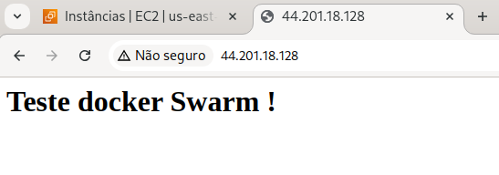
</p>

### Replicando os dados nos demais nós

- No nó de origem (aonde está o volume)
  - Instalando o servidor de arquivos
  ```console
  root@aws1:/var/lib/docker/volumes/app/_data# apt install nfs-server
  ```

  - Configurando o compartilhamento do volume
  ```console
  root@aws1:/var/lib/docker/volumes/app/_data# nano /etc/exports
  ```
  ```
  # /etc/exports: the access control list for filesystems which may be exported
  #               to NFS clients.  See exports(5).
  #
  # Example for NFSv2 and NFSv3:
  # /srv/homes       hostname1(rw,sync,no_subtree_check) hostname2(ro,sync,no_subtree_check)
  #
  # Example for NFSv4:
  # /srv/nfs4        gss/krb5i(rw,sync,fsid=0,crossmnt,no_subtree_check)
  # /srv/nfs4/homes  gss/krb5i(rw,sync,no_subtree_check)
  #
  /var/lib/docker/volumes/app/_data *(rw,sync,subtree_check)
  ```
    - `*` : todos os arquivos
    - rw : permissão de escrita e leitura
    - sync : sincronizar os arquivos em todos os nós
    - subtree_check : compartilhar sub pastas

  - exportando
  ```console
  root@aws1:/var/lib/docker/volumes/app/_data# exportfs -ar
  ```

- Liberando o serviço nfs e Todos os UDPs nas regras de entrada

<p align=center>
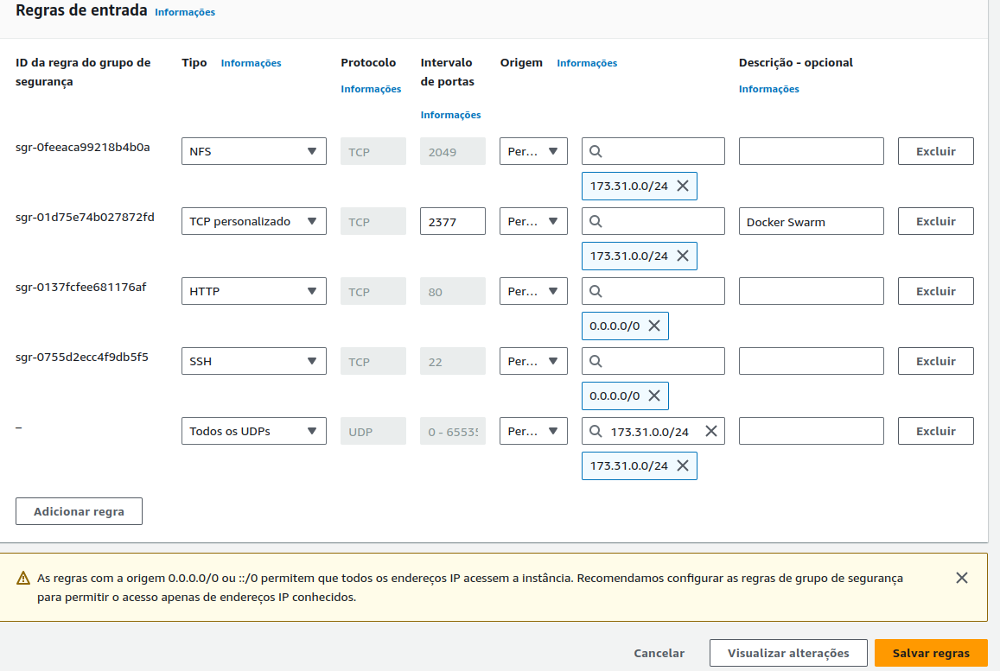
</p>

- Nos demais nós
  - Logar nos nós

  - Instalando o cliente de arquivos
  ```console
  ubuntu@aws2:~$ sudo su
  root@aws2:/home/ubuntu# apt install nfs-common -y
  ```

  - Verificando os arquivos montados usando o IP privado do servidor
  ```console
  root@aws2:/home/ubuntu# showmount -e 173.31.0.139
  Export list for 173.31.0.139:
  /var/lib/docker/volumes/app/_data *
  ```
  - Montando o volume de arquivos
  ```console 
  root@aws2:/home/ubuntu# mount 173.31.0.139:/var/lib/docker/volumes/app/_data /var/lib/docker/volumes/app/_data
  ```

## Load balance com banco de dados MySQL e aplicação PHP

### Banco de dados

- Removendo serviços em execução
```console
ubuntu@aws1:~$ sudo su
root@aws1:/home/ubuntu# docker service ls
ID             NAME      MODE         REPLICAS   IMAGE          PORTS
muktk5hsrf5x   meu-app   replicated   15/15      httpd:latest   *:80->80/tcp
root@aws1:/home/ubuntu# docker service rm meu-app
meu-app
```

- Criando um volume para o container do banco de dados

```console 
root@aws1:/home/ubuntu# docker volume create data
data
```

- Criando um container do banco de dados MySQL 

Esse container não terá réplicas

```console
root@aws1:/home/ubuntu# docker run -e MYSQL_ROOT_PASSWORD=Senha123 -e MYSQL_DATABASE=meubanco --name mysql-A -d -p 3306:3306 --mount type=volume,src=data,dst=/var/lib/mysql mysql:5.7
Unable to find image 'mysql:5.7' locally
5.7: Pulling from library/mysql
20e4dcae4c69: Pull complete 
1c56c3d4ce74: Pull complete 
e9f03a1c24ce: Pull complete 
68c3898c2015: Pull complete 
6b95a940e7b6: Pull complete 
90986bb8de6e: Pull complete 
ae71319cb779: Pull complete 
ffc89e9dfd88: Pull complete 
43d05e938198: Pull complete 
064b2d298fba: Pull complete 
df9a4d85569b: Pull complete 
Digest: sha256:4bc6bc963e6d8443453676cae56536f4b8156d78bae03c0145cbe47c2aad73bb
Status: Downloaded newer image for mysql:5.7
0b20fc6c233e9bd2037e11f1bc70397f3f33b2298458d807b81c3e9809a41b34
```

  - Verificando se está rodando

  ```console
  root@aws1:/home/ubuntu# docker ps
  CONTAINER ID   IMAGE       COMMAND                  CREATED              STATUS              PORTS                                                  NAMES
  0b20fc6c233e   mysql:5.7   "docker-entrypoint.s…"   About a minute ago   Up About a minute   0.0.0.0:3306->3306/tcp, :::3306->3306/tcp, 33060/tcp   mysql-A
  ```

- Liberando a porta 3306 para o SQL em regras de entrada na AWS

<p align=center>
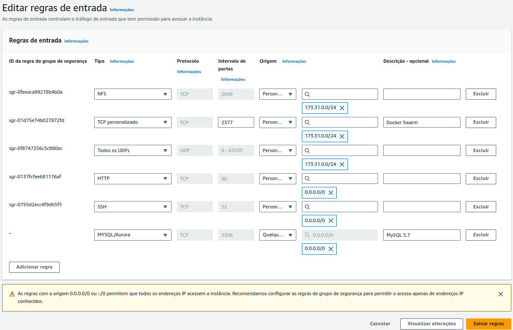
</p>

- Conectei ao banco de dados `meubanco`com o DBeaver e criei uma tabela

```sql
CREATE TABLE dados (
	id int,
	data1 varchar(50),
	data2 varchar(50),
	hostname varchar(50),
	ip varchar(50)
);
```

### Aplicação PHP

- Deletando o arquivo index.html antigo

```console
root@aws1:/home/ubuntu# cd /var/lib/docker/volumes/app/_data/
root@aws1:/var/lib/docker/volumes/app/_data# ls
index.html
root@aws1:/var/lib/docker/volumes/app/_data# rm index.html
```      

- Criando o arquivo index.php

```console
root@aws1:/var/lib/docker/volumes/app/_data# nano index.php
```
Conteúdo disponível no github do instrutor [`index.php`](https://github.com/denilsonbonatti/docker-app-cluster/blob/main/index.php)

  - Em servername colocar o IP do host (nó em que está o banco de dados)
  - Preencher os dados de senha e nome do banco

- Criando o serviço da aplicação PHP com réplicas

```console
root@aws1:/var/lib/docker/volumes/app/_data# docker service create --name meu-app --replicas 15 -dt -p 80:80 --mount type=volume,src=app,dst=/app/ webdevops/php-apache:alpine-php7
6r9dl9qo34ckksgt0qqky0b6o
```

- Podemos ver que está rodando no navegador

<p align=center>
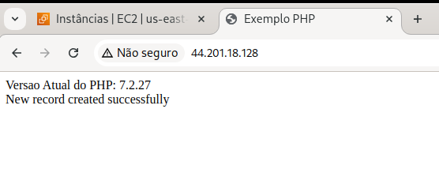
</p>

- Dados foram inseridos no banco de dados

<p align=center>
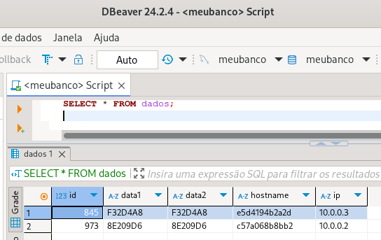
</p>

### Proxy com NGINX

O proxy é o responsável por distribuir as requisições

- Criando uma pasta para configurar o proxy

```console
Last login: Mon Nov 11 20:21:38 2024 from 45.172.79.245
ubuntu@aws1:~$ sudo su
root@aws1:/home/ubuntu# mkdir /proxy
root@aws1:/home/ubuntu# cd /proxy/
root@aws1:/proxy# 
```

- Criando arquivo de configuração

```console
root@aws1:/proxy# nano nginx.conf
```

```
http {

    upstream all {
        server 173.31.0.139;
        server 173.31.0.109;
        server 173.31.0.174;
        server 173.31.0.132;
    }

    server {
        listen 4500;
        location / {
            proxy_pass http://all/;
        }
    }
}


events { }
```

- Criando o dockerfile
```console
root@aws1:/proxy# nano dockerfile
```

```yaml
FROM nginx
COPY nginx.conf /etc/nginx/nginx.conf
```

- Gerando a imagem do container

```console
root@aws1:/proxy# docker build -t proxy-app .
```

- Conferindo as imagens

```console
root@aws1:/proxy# docker image ls
REPOSITORY             TAG       IMAGE ID       CREATED          SIZE
proxy-app              latest    5f27480c67cc   56 seconds ago   192MB
httpd                  <none>    1bcf11fa154f   3 months ago     148MB
mysql                  5.7       5107333e08a8   11 months ago    501MB
webdevops/php-apache   <none>    727c1b287b3f   4 years ago      286MB
```

- Rodando o container do proxy

```console
root@aws1:/proxy# docker run --name my-proxy-app -dti -p 4500:4500 proxy-app
7b9d9652feb8c7c60fe4f8df902de5c8b0cde93637cf47e8a580d39b94fc43f7
```

- Liberando a porta 4500 nas regras de entrada da AWS

<p align=center>

</p>


## Teste de stress 

Executei o teste de stress no [loader.io](https://loader.io/) utilizando o arquivo
index.php que insere dados no banco de dados

<p align=center>
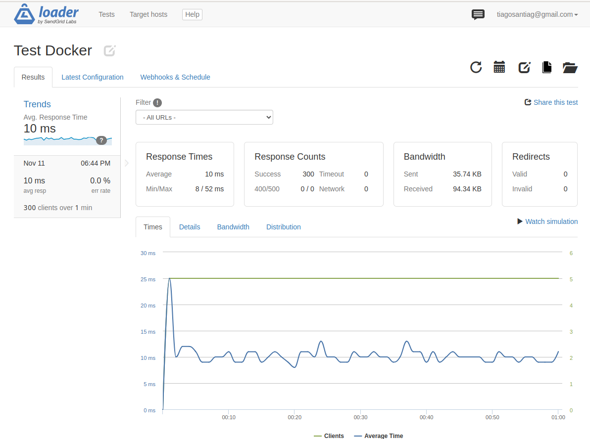
</p>


- Podemos ver pelo hostname do dados inseridos que o load balance está funcionando e as solicitações são distribuídas nas réplicas dos containers

<p align=center>

</p>
