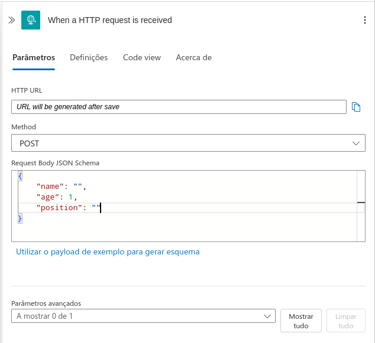

<h1>

    Microsoft Azure Advanced
</h1>

# :computer: Trabalhando Aplicações Serverless na Azure

Nesse desafio vamos configurar um logic app na azure com um request http para enviar dados (post) seguindo um template json. Utilizando o link fornecido pelo http request realizamos a operação de post utilizando o postman.

## :buld: Solução do desafio

Criando um workspace do log analytics:

Criando o logic app, usando o log analytics workspace:

Ligando a identidade sistema atribuída:

Criando o service bus:

Criando a fila (service bus):

Checando acesso ao service bus:

Checando acesso a fila: 

HTTP request

Enviando dados:

Checando histórico:

Vemos que nosso post funcionou corretamente.

Mesmo com acesso completo ao service bus e fila não aparece a opção de adicionar o service bus ao logic app.

